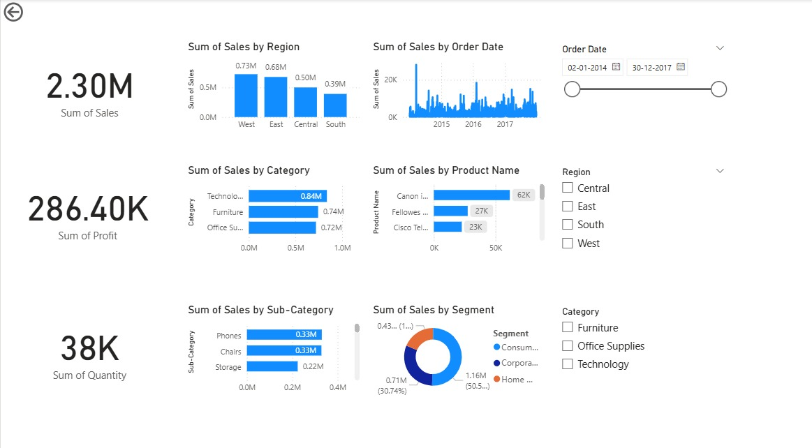

# Sales Analysis Dashboard with Power BI

## Project Overview

This project presents an interactive sales analysis dashboard created with Microsoft Power BI. It leverages the "Superstore" dataset to perform an in-depth analysis of sales performance across various business dimensions. The primary goal is to provide stakeholders with actionable insights through intuitive data visualizations, enabling better-informed business decisions.

## Dashboard Preview



## Demo Video

A short video demonstrating the dashboard's features and interactivity can be found here:

[**Watch the Demo Video**](https://youtu.be/j_GQEWRSf9Q)

## 🚀 Features

* **At-a-Glance KPIs:** Key Performance Indicators for Total Sales, Total Profit, and Total Quantity provide an immediate snapshot of overall performance.
* **Geographical Analysis:** A map visual and regional bar chart display sales distribution across different areas, helping to identify key markets.
* **Product Performance:** Visual breakdowns of sales by Category and Sub-Category allow for easy identification of top-performing product lines.
* **Customer Segmentation:** Analysis of sales by customer segment (e.g., Consumer, Corporate) to understand the customer base better.
* **Time-Series Analysis:** A line chart illustrates sales trends over time, highlighting seasonality and growth patterns.
* **Interactive Filtering:** The dashboard is fully interactive, with slicers for Order Date, Region, and Category, allowing for dynamic, on-the-fly data exploration.
* **Drill-Down Functionality:** Users can drill down into data hierarchies within a single visual (e.g., view Sub-Categories within a selected Category) for more granular analysis.

## 📊 Dataset

This project uses the **Superstore Dataset**, a well-known public dataset for data analysis and visualization practice. It contains thousands of records of orders from a fictional superstore, including information on customers, products, sales, profit, shipping, and more.

## 🛠️ Tools Used

* **Microsoft Power BI Desktop:** The primary tool used for data modeling, creating DAX measures, and designing the interactive dashboard.

## 📂 Repository Files

```
.
├── Sales Dashboard Using Power BI.pbix      # The main Power BI project file
├── Dashboard_ss.jpg            # A static image of the final dashboard
└── README.md                 # This file
```

## 📖 How to Use

To explore the dashboard on your own machine:

1.  **Install Power BI Desktop:**
    If you don't have it already, download and install it from the [official Microsoft website](https://powerbi.microsoft.com/en-us/desktop/).

2.  **Download the `.pbix` file:**
    Clone this repository or download the `Sales_Dashboard.pbix` file.

3.  **Open the file:**
    Launch Power BI Desktop and open the downloaded `.pbix` file.

You can now interact with all the visuals, apply filters, and explore the sales data.
